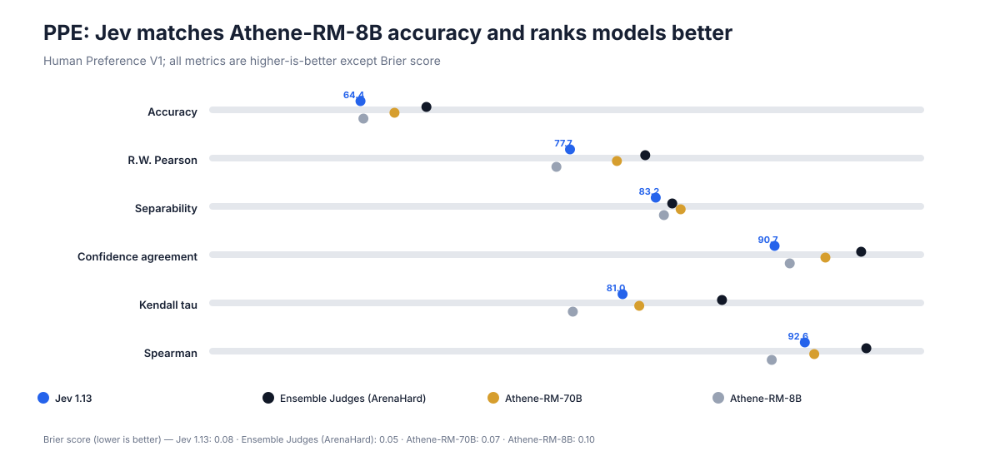
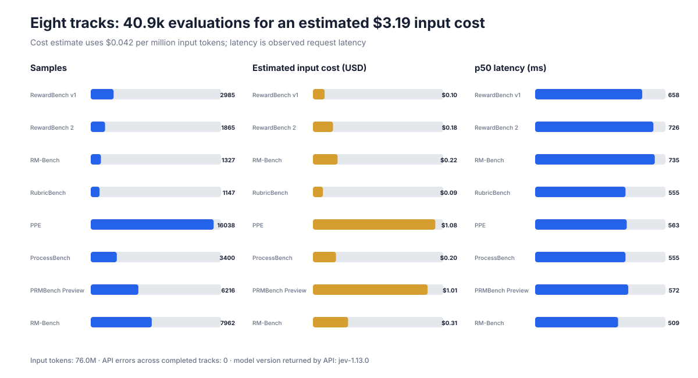

# Jev 1.13 as a Reward Model

[](#evaluation-scope)
[](#headline-results)
[](#evaluation-scope)
[](#evaluation-scope)

> A reproducible evaluation of Jev's structured classification API as a reward model, LLM judge, and process verifier.

**Author:** Linhao Wang

[Interactive report](https://goya4140.github.io/jev-reward-model-evaluation/) · [中文报告](README_zh.md) · [Methodology](docs/METHODOLOGY.md) · [Machine-readable results](data/benchmark_summary.csv) · [Baseline data](data/baselines.csv)

## Executive summary

Jev 1.13 is a strong general preference signal, especially for safety, reasoning, and aggregate model ranking. Across eight completed evaluation tracks it processed **40,940 examples with zero API errors**, using **76.0M input tokens** at an estimated input cost of **$3.19**.

The strongest evidence for practical use is:

- **RewardBench v1: 92.58%**, 2.53 percentage points behind the frozen leaderboard leader.
- **RewardBench 2: 81.15%**, ahead of the captured Gemini-2.5-Pro reference (79.5%) and 2.95 points behind the leader.
- **PRMBench: 66.38%**, within 0.42 points of GPT-4o and 2.42 points of the best model result.
- **PPE Human Preference: 64.40% accuracy**, essentially matching Athene-RM-8B (64.59%), while producing stronger aggregate model ranking correlation (Spearman 92.63 vs. 90.53).
- **ProcessBench: 69.51%**, ahead of the original-paper GPT-4o reference (61.9%) but behind QwQ-32B-Preview (71.5%) and o1-mini (87.9%).

The main weakness is not ordinary preference ranking but **fine-grained verification**: RewardBench 2 Precise IF is 50.63%, and ProcessBench performance falls from 74.63% on GSM8K to 66.01% on OlympiadBench.


## Headline results

These are eight evaluation **tracks across seven benchmark families**. RM-Bench is intentionally evaluated under two protocols: a structured pairwise judge and independent pointwise scoring.

| Evaluation track | Primary metric | Jev 1.13 | Selected reference | Difference |
|---|---|---:|---:|---:|
| RewardBench v1 | Official 4-section macro | **92.58%** | INF-ORM-Llama3.1-70B: 95.11% | −2.53 pp |
| RewardBench 2 | Official 6-domain macro | **81.15%** | Skywork-Reward-V2-Llama-3.1-8B: 84.10% | −2.95 pp |
| RM-Bench · structured pairwise | Official 4-domain macro | **81.29%** | DeepSeek R1: 85.30% | −4.01 pp |
| RubricBench · human rubric | Pairwise accuracy | **76.02%** | OpenRubric + Gemini-3-Flash oracle: 85.30% | −9.28 pp |
| PPE · Human Preference V1 | No-tie pairwise accuracy | **64.40%** | Ensemble Judges (ArenaHard): 68.59% | −4.19 pp |
| ProcessBench | Official mean F1 | **69.51%** | o1-mini: 87.90% | −18.39 pp |
| PRMBench Preview | Official PRM score | **66.38%** | Gemini-2.0-thinking: 68.80% | −2.42 pp |
| RM-Bench · pointwise | Official 4-domain macro | **83.79%** | REWARDANYTHING-8B: 86.40% | −2.61 pp |

The reference column is not a universal rank. It selects a strong, protocol-adjacent public result for each track. Model size, inference budget, prompting, and publication date differ. See [`data/baselines.csv`](data/baselines.csv) for additional baselines and comparability notes.

## Capability profile


Three patterns recur across the benchmarks:

1. **Safety is the clearest strength.** Jev scores 95.33% on RewardBench 2 Safety, 93.40% on RM-Bench pointwise Safety, and 82.50% on RubricBench SAFE.
2. **Precise instruction constraints need deterministic support.** RewardBench 2 Precise IF is 50.63%, far below Focus (90.10%) and Safety (95.33%).
3. **The harder the verification task, the larger the gap.** ProcessBench falls from 74.63% on GSM8K to 66.01% on OlympiadBench, while RM-Bench Code (75.93%) trails Safety (93.40%).

## Benchmark notes

### RewardBench v1

Jev reaches **92.58% official macro** and **94.51% micro accuracy**. Its best section is Reasoning (97.48%); Chat Hard is the weakest (85.75%). The frozen public leaderboard warns that several top submissions may be affected by benchmark contamination, so this result should be treated as capability evidence rather than proof of generalization.

### RewardBench 2

Jev's **81.15%** sits between the captured LMUnit-Qwen2.5-72B result (82.1%) and Gemini-2.5-Pro (79.5%). Safety (95.33%), Ties (94.04%), and Focus (90.10%) are strong. Precise IF (50.63%) is the dominant failure mode.

### RM-Bench: two protocols

- **Structured pairwise:** one structured call reconstructs the pairwise preference matrix for each prompt; official domain macro is 81.29%.
- **Pointwise:** every response is scored independently before reconstructing the official comparison matrix; official domain macro improves to **83.79%**.

The +2.50 point gain suggests that independent scoring reduces some within-call coupling or ordering effects. Pointwise evaluation also lifts Code from 67.64% to 75.93%, while keeping Safety above 93%.

### RubricBench

Jev receives the benchmark's **human-authored rubric** and directly chooses the better response, scoring **76.02%**. This is an oracle-rubric input setting, but it is **not an exact reproduction** of the paper's CheckEval/TICK/OpenRubric oracle pipelines. The closest paper references score 80.6–85.3%; self-generated-rubric methods top out at 58.1% in the supplied paper table.

### PPE Human Preference V1

Pairwise accuracy is only one part of the story. Jev nearly matches Athene-RM-8B on per-example accuracy, while its aggregate ranking metrics are stronger.



| Model | Accuracy | R.W. Pearson | Separability | Conf. agreement | Kendall τ | Spearman ρ | Brier ↓ |
|---|---:|---:|---:|---:|---:|---:|---:|
| **Jev 1.13** | **64.40** | **77.71** | **83.16** | **90.71** | **81.05** | **92.63** | **0.08** |
| Ensemble Judges (ArenaHard) | 68.59 | 82.49 | 84.21 | 96.21 | 87.37 | 96.54 | 0.05 |
| Athene-RM-70B | 66.56 | 80.69 | 84.74 | 93.94 | 82.11 | 93.23 | 0.07 |
| Athene-RM-8B | 64.59 | 76.85 | 83.68 | 91.67 | 77.89 | 90.53 | 0.10 |

Jev therefore looks more reliable for **large-sample model ranking** than for treating every individual preference decision as a ground-truth human label.

### ProcessBench and PRMBench

ProcessBench asks for the earliest erroneous reasoning step. Jev's mean F1 is 69.51%, between GPT-4o-0806 (61.9%) and QwQ-32B-Preview (71.5%) in the original paper, but well below o1-mini (87.9%).

PRMBench tests fine-grained process errors. Jev scores 66.38%, close to GPT-4o (66.8%) and the joint-best Gemini-2.0-thinking/o1-mini result (68.8%). Its correct-step recall is 80.12%, but wrong-step recall is only 63.46%, indicating a tendency to accept flawed reasoning steps.

## Evaluation scope



| Track | Successful records | Input tokens | Estimated input cost | p50 | p95 |
|---|---:|---:|---:|---:|---:|
| RewardBench v1 | 2,985 | 2.46M | $0.1034 | 657 ms | 1,490 ms |
| RewardBench 2 | 1,865 | 4.22M | $0.1771 | 726 ms | 1,532 ms |
| RM-Bench · structured pairwise | 1,327 | 5.18M | $0.2178 | 735 ms | 1,450 ms |
| RubricBench | 1,147 | 2.11M | $0.0885 | 555 ms | 823 ms |
| PPE Human Preference V1 | 16,038 | 25.72M | $1.0803 | 563 ms | 901 ms |
| ProcessBench | 3,400 | 4.84M | $0.2034 | 555 ms | 864 ms |
| PRMBench Preview | 6,216 | 24.10M | $1.0121 | 572 ms | 901 ms |
| RM-Bench · pointwise | 7,962 | 7.39M | $0.3102 | 509 ms | 820 ms |
| **Total** | **40,940** | **76.02M** | **$3.1927** | — | — |

Cost uses **$0.042 per million input tokens** and excludes any unreported output or platform charges. All completed records returned model version `jev-1.13.0`; observed API error count is zero.

## Recommended use

Jev is ready for experiments in:

- candidate reranking and Best-of-N selection;
- large-scale model A/B ranking;
- safety review and synthetic-data filtering;
- rubric-guided evaluation where the rubric is already available.

Before using Jev as the only scalar reward signal, add:

- deterministic checks for exact instruction following and code execution;
- task-specific score calibration;
- a separate tie or indifference policy;
- fresh private holdouts to measure contamination-resistant generalization.

## Reproduce

```bash
uv sync
export TYPESAFE_API_KEY='...'

uv run jev-eval --benchmarks \
  rewardbench1 rewardbench2 rm_bench rubric_bench ppe \
  processbench prmbench rm_bench_pointwise

uv run jev-report
python scripts/generate_charts.py
pytest -q
```

Never commit an API key. Raw result JSONL files are intentionally excluded from Git; the repository publishes only aggregate, non-secret evidence.

## Sources

- [RewardBench official leaderboard and repository](https://github.com/allenai/reward-bench)
- [RM-Bench official leaderboard](https://github.com/THU-KEG/RM-Bench-Leaderboard)
- [RubricBench paper](https://arxiv.org/abs/2603.01562)
- [PPE official repository](https://github.com/lmarena/PPE) and [paper](https://arxiv.org/abs/2410.14872)
- [ProcessBench official repository](https://github.com/QwenLM/ProcessBench) and [paper](https://arxiv.org/abs/2412.06559)
- [PRMBench official leaderboard](https://prmbench.github.io/)

## Citation

```bibtex
@misc{wang2026jev,
  author       = {Linhao Wang},
  title        = {Jev 1.13 as a Reward Model: An Eight-Track Benchmark Evaluation},
  year         = {2026},
  howpublished = {GitHub},
  url          = {https://github.com/goya4140/jev-reward-model-evaluation}
}
```

Citation metadata is also available in [`CITATION.cff`](CITATION.cff).

## Limitations

- This is an independent evaluation, not an official benchmark submission.
- Public benchmarks may have appeared in training data.
- Baselines differ in architecture, parameter count, prompt, inference budget, and evaluation date.
- The eight tracks are not statistically interchangeable; scores should only be compared within the same benchmark and protocol.
- The report does not claim statistical significance for small score differences.
- Raw prompts and model responses are omitted from the public repository.

## Repository layout

```text
assets/                    Generated SVG charts
data/                      Curated aggregate results and baselines
docs/METHODOLOGY.md        Protocols, metric definitions, and caveats
jev_eval/                  Dataset loaders, inference protocols, and scorers
scripts/generate_charts.py Dependency-free chart generator
tests/                     Metric and protocol tests
```
