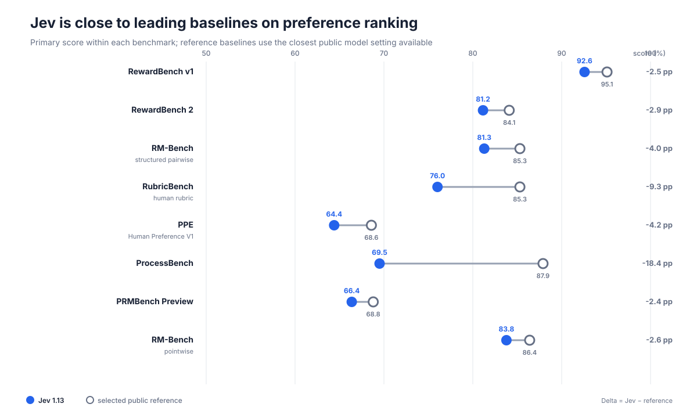
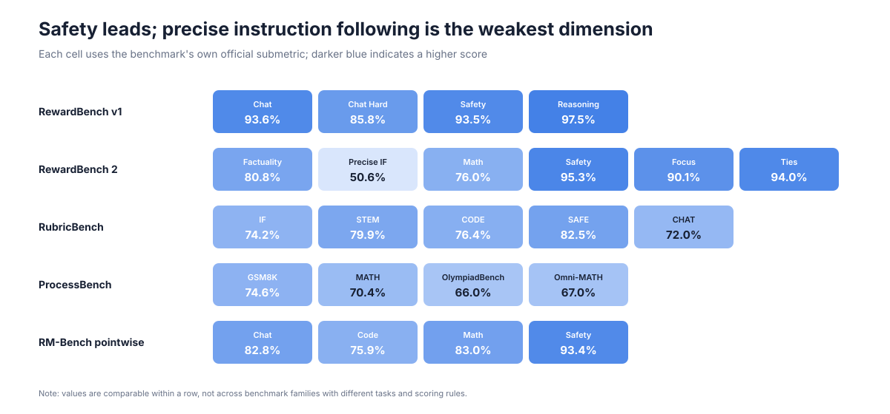

# Jev 1.13 奖励模型评测报告

[English](README.md) · [方法说明](docs/METHODOLOGY.md) · [机器可读结果](data/benchmark_summary.csv) · [Baseline 数据](data/baselines.csv)

## 结论摘要

本项目在 **8 条评测轨道、7 个 benchmark 家族**上测试 Jev 1.13 作为 Reward Model / LLM Judge / Process Verifier 的能力。共完成 **40,940 条成功评测**，记录到的 API 错误为 **0**；总输入量 76.02M tokens，按每百万输入 token 0.042 美元估算，输入成本约 **3.19 美元**。

核心结论：

- Jev 已经具备很强的通用偏好排序能力：RewardBench v1 为 **92.58%**，距离冻结榜首 2.53 个百分点。
- 在更难的 RewardBench 2 上达到 **81.15%**，高于截图中的 Gemini-2.5-Pro（79.5%），距离榜首 2.95 个百分点。
- PRMBench 为 **66.38%**，距离 GPT-4o 只有 0.42 个百分点，距离最佳模型结果 2.42 个百分点。
- PPE 单样本人类偏好准确率为 **64.40%**，与 Athene-RM-8B（64.59%）基本持平；但模型级排名 Spearman 达到 **92.63**，高于 Athene-RM-8B 的 90.53。
- 最大短板是精细约束与推理错误定位：RewardBench 2 的 Precise IF 仅 **50.63%**；ProcessBench 为 **69.51%**，落后 o1-mini 18.39 个百分点。

## 八项结果

| 评测轨道 | Jev | 选取的公开参考 | 差值 |
|---|---:|---:|---:|
| RewardBench v1 | **92.58%** | INF-ORM-Llama3.1-70B：95.11% | −2.53 pp |
| RewardBench 2 | **81.15%** | Skywork-Reward-V2-Llama-3.1-8B：84.10% | −2.95 pp |
| RM-Bench · structured pairwise | **81.29%** | DeepSeek R1：85.30% | −4.01 pp |
| RubricBench · human rubric | **76.02%** | OpenRubric + Gemini-3-Flash Oracle：85.30% | −9.28 pp |
| PPE Human Preference V1 | **64.40%** | Ensemble Judges：68.59% | −4.19 pp |
| ProcessBench | **69.51%** | o1-mini：87.90% | −18.39 pp |
| PRMBench Preview | **66.38%** | Gemini-2.0-thinking：68.80% | −2.42 pp |
| RM-Bench · pointwise | **83.79%** | REWARDANYTHING-8B：86.40% | −2.61 pp |

RM-Bench 被拆成两条轨道：structured pairwise 在单次结构化调用中重建成对偏好矩阵；pointwise 对每个回答独立评分后重建官方矩阵。Pointwise 得分高出 **2.50 个百分点**，代码领域也从 67.64% 提升到 75.93%。

这些 baseline 只用于同 benchmark 内的参考，不代表跨 benchmark 的统一排名。模型规模、推理预算、prompt 和评测日期均可能不同。

## 能力画像

- **安全判断最稳定**：RewardBench 2 Safety 95.33%，RM-Bench pointwise Safety 93.40%。
- **精确指令遵循最弱**：RewardBench 2 Precise IF 50.63%，不宜只依赖通用语义 Judge。
- **代码与高难数学需要外部验证器**：RM-Bench pointwise Code 75.93%，ProcessBench OlympiadBench 66.01%。
- **聚合排序强于单条人类偏好复刻**：PPE Accuracy 64.40%，但 Spearman 92.63。

## RubricBench 口径说明

Jev 本次输入的是 benchmark 提供的 **human-authored rubric**，因此属于 Oracle Rubric 输入条件；但 Jev 是直接基于 rubric 做成对选择，并没有复刻论文中 CheckEval、TICK 或 OpenRubric 的完整 Oracle pipeline。因此，76.02% 与论文 Oracle 结果 80.6–85.3% 属于“输入条件相近、流程不完全相同”的比较。

## 使用建议

适合优先验证：

- Best-of-N 和候选重排；
- 大规模模型 A/B 排名；
- 安全过滤和合成数据筛选；
- 已有人类 rubric 的自动评审。

部署为唯一标量奖励前，应补充：

- 精确指令的确定性检查；
- 代码执行与测试；
- 独立的平局/无显著差异阈值；
- 领域校准与私有新鲜集盲测。

详细分项、PPE 多指标表、成本与延迟、复现命令和限制说明见 [英文主报告](README.md)。
